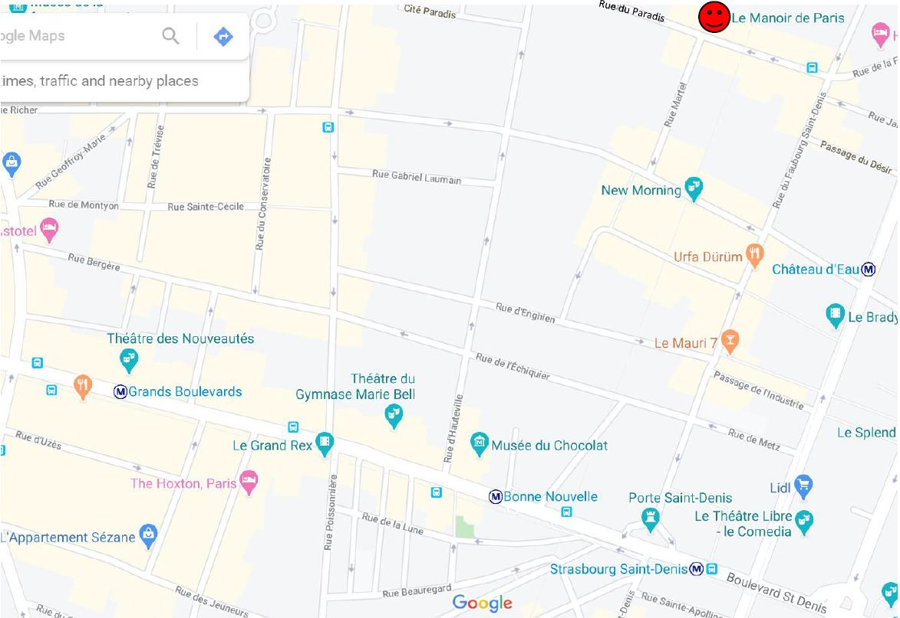

Voici quelques exercices corrigés pour t'entrainer sur les algorithmes.

[Exercice 1](#exercice-1)  
[Exercice 2](#exercice-2)  
[Exercice 3](#exercice-3)  
[Exercice 4](#exercice-4)  
[Exercice 5](#exercice-5)    
[Exercice 6](#exercice-6)

---
## Exercice 1

Un étudiant vous propose l’algorithme suivant, pour trouver un nombre impair au hasard.
1. Lancer un dé à 6 faces
2. Multiplier le résultat obtenu par le dé par 2
3. Additionner 3 au résultat de la multiplication

a) Combien d’instructions compte cet algorithme ?  
b) Cet algorithme produira-t-il toujours des entiers impairs ?  
c) Cet algorithme contient-il des conditions ?  

**Correction**

a) 3 instructions  
b) Oui  
c) Non, il s'agit simplement d'une suite d'instructions  

---
## Exercice 2

D’après la liste désordonnée suivante, écris un algorithme qui permet de choisir sa tenue:
- Regarder la température
- Mettre un pull
- Mettre seulement un tee-shirt
- 10°C < température < 20°C
- Température < 10°C
- Température > 20°C
- Mettre un manteau

**Indices**

Relie les instructions entre elles en considérant les différents cas de figure.  
Pense à utiliser les conditions (Si... Alors).

**Correction**

- Regarder la température
- Si température < 10 C
	- Alors Mettre un manteau
- Si 10 C < température < 20 C
	- Alors Mettre un pull
- Si température > 20 C
	- Alors Mettre seulement un tee shirt

---
## Exercice 3

Vous êtes au métro Grands Boulevards. Expliquez, étape par étape, comment se rendre au Manoir de
Paris.

**Correction**

- Prendre le Boulevard Saint Denis jusqu’au croisement avec la rue d’Hauteville.
- Tourner à gauche sur la rue d’Hauteville
- Tourner à droite sur la rue de l’échiquier au premier croisement	
- Au bout de la rue, tourner à gauche sur la rue du Faubourg Saint Denis
- Tourner à gauche sur la rue du Paradis
- Au croisement avec la rue Martel, vous êtes arrivé

---
## Exercice 4 

Que fait cet algorithme ?

	Variable N en Entier
	Debut
	N ← 0
	Ecrire "Entrez un nombre entre 1 et 3"
	TantQue N < 1 ou N > 3
		Lire N
		Si N < 1 ou N > 3 Alors
			Ecrire "Saisie erronée. Recommencez”
		FinSi
	FinTantQue
	Fin

**Correction**

Cet algorithme demande à l’utilisateur un nombre compris entre 1 et 3 jusqu’à ce que la réponse convienne.

[Explications en video](lien_vers_la_video)

---
## Exercice 5

Si on fait s’exécuter cet algorithme en lui donnant en entrée les valeurs 3, 7 et 12, qu’est-ce que l’algorithme affichera comme sortie ?

	Variables :
	type entier : a, b, c
	a ← 0
	b ← 0
	c ← 0
	Écrire « Entrer trois valeurs entières. »
	Lire a, b, c
	b ← a
	c ← a
	a ← b + c * 2
	Écrire « Le résultat est : », a
	Si a égale 8 OU a ≥ 3 alors
		Écrire « Votez pour Pedro. »
	Sinon si a ≥ 7
		Écrire « ¡Hola! »
	FinSi

**Correction**

L'algorithme affichera :
	
	Le résultat est : 9
	Votez pour Pedro.

[Explications en video](lien_vers_la_video)

---
## Exercice 6

Ecrire un programme en pseudo-code qui lit le prix HT d’un article, le nombre d’articles et le taux de TVA, et qui fournit le prix total TTC correspondant. Faire en sorte que des libellés apparaissent clairement.

**Correction**

	
	Variables nb, pht, ttva, pttc en Numérique
	Début
	Ecrire « Entrez le prix hors taxes: »
	Lire pht
	Ecrire « Entrez le nombre d’articles: »
	Lire nb
	Ecrire « Entrez le taux de TVA: »
	Lire ttva
	pttc <- pht * nb * ttva
	Ecrire pttc

