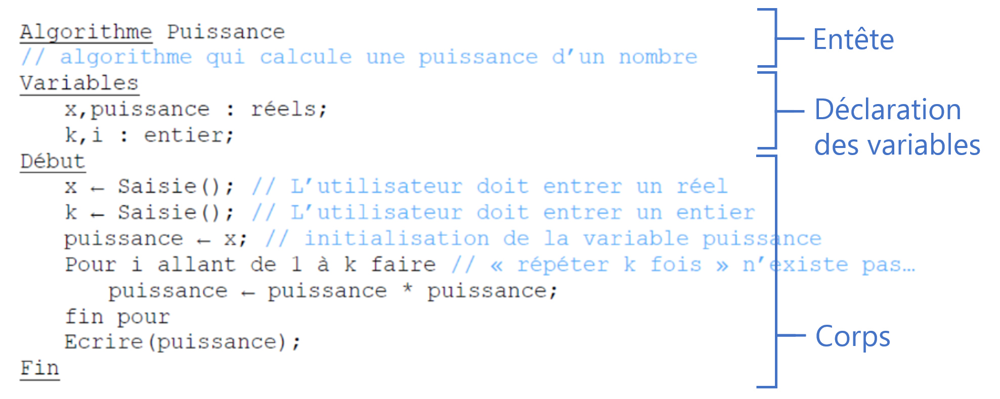

## But de ce TD

Comprendre le fonctionnement d’un **algorithme** pas-à-pas.
Traduire un problème en pseudo-code et inversement.

## Pour ce TD

_Savoir écrire un algorithme :_

Connaître les différents types de **boucles**, les **conditions**, la **structure** d’un algorithme.
Savoir manipuler les **variables**, afficher et lire.
Comprendre un **organigramme**.

### Variable

_Espace mémoire permettant de stocker des éléments comme des nombres, caractères, phrases ou autre._

Une variable possède un **nom**, une **valeur**, un **type** et une **adresse**.

### Exemple

_Variable_ compteur : entier **déclaration**

_compteur_ ← 10 **affectation**

Ici, la variable a pour nom “compteur”. Son type est un entier et sa valeur est 10. L’adresse n’est pas spécifiée mais nous n’en avons pas besoin pour manipuler la variable.

### Types de variable principaux

_Caractère_ : 'a'

_Chaîne de caractères_ : "Bonjour, comment vas-tu ?"

_Réel_ : 10.7

_Entier_ : 20

_Booléen_ : VRAI ou FAUX

### Quelques opérateurs

Les opérateurs logiques ('' vrai ou faux ‘’)

◼ _L'opérateur NON_. Donne le contraire de la variable.
Exemple : Si A = vrai alors NON A = faux

◼ _L'opérateur ET_. Seulement VRAI ET VRAI donne VRAI.
Exemple : Soient A vrai et B faux. Alors (A ET B) est faux.

◼ _L'opérateur OU_. Seulement FAUX OU FAUX donne FAUX.
Exemple : Soient A vrai et B faux. Alors (A OU B) est vrai.

_Condition :_
Si conditions Alors (**Sinon est optionnel**)

    {instructions}

Sinon

    {instructions}

FinSi

_Structure d’un algorithme :_
Entête, déclaration des variables et corps

