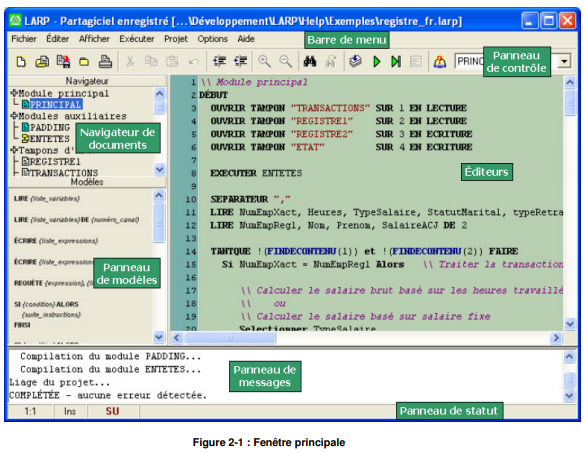
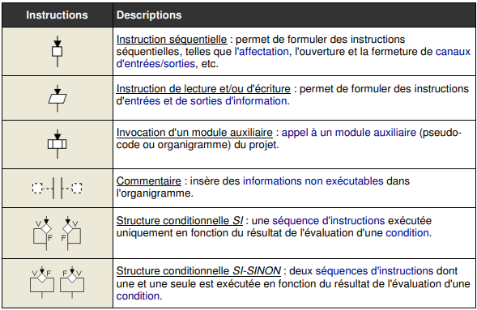
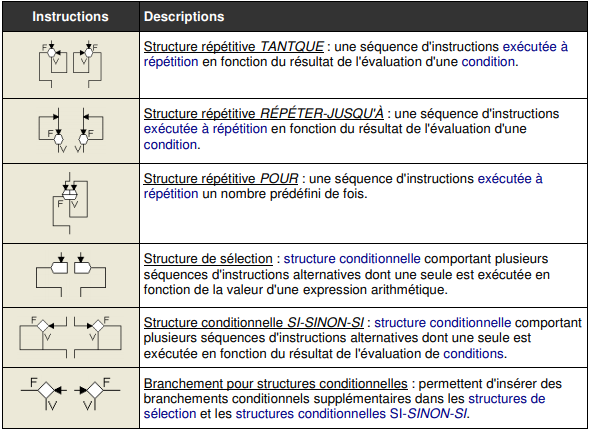
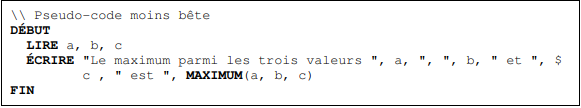
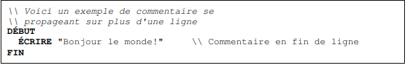
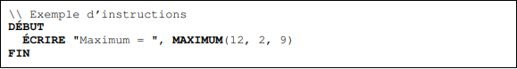
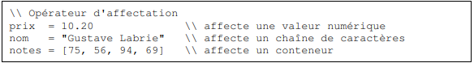

## But de ce TD

Comprendre le fonctionnement d’un logiciel : **LARP.**
Savoir écrire un algorithme sous la forme d’un **organigramme** et en **pseudo-code**.

Documentation complète LARP :
_http://larp.marcolavoie.ca/fr/Files/LarpFrV3.pdf_

## Comprendre l'interface

• **Le panneau de contrôle** donne un accès rapide à diverses commandes de la barre de menu de LARP.

• **Les éditeurs** constituent le panneau central de la fenêtre, où le programmeur transcrit les algorithmes à exécuter.

• **Le panneau de messages** affiche divers messages (informations, avertissements et erreurs) habituellement générés lors de la compilation et l'exécution d'algorithmes.

• **Le navigateur de documents** énumère les différents modules d'entrées/sorties contenus dans le projet LARP en cours d'édition.

• **Le panneau de modèles** permet à l'utilisateur d'insérer des composants d'algorithmes par glisser-déposer.

• **Le panneau de statut** affiche diverses informations sur l'état courant de LARP, dont des phrases d’aide interactives quand l’utilisateur déplace la souris sur un composant de l’interface.

## Instructions pour la création d’organigrammes

### Instructions pour la création d’un pseudo-code

De la même manière que pour les organigrammes, il est possible de glisser-déposer des morceaux de code. Par exemple, ci-dessous on a un bloc où l’on peut modifier directement notre condition initiale et la suite des instructions :

SI {condition} ALORS

    {suite_instructions}

SINON

    {suite_instructions}

FINSI

### Syntaxe du pseudo-code LARP

**Voir page 89 et suivantes de la documentation pour plus de détails et exemples.**

_http://larp.marcolavoie.ca/fr/Files/LarpFrV3.pdf_

• Un algorithme LARP doit débuter par l'instruction **DÉBUT** et se terminer par l’instruction **FIN**.

• **Les instructions pseudo-code d'un module sont généralement écrites sur des lignes séparées.** Ainsi, un changement de ligne indique la fin d'une instruction et le début de la suivante. Cependant il est possible de **prolonger une longue instruction** sur la ligne suivante en terminant la première ligne de l'instruction par **le symbole \$** :

• **L’écriture de commentaires** se fait avec \\

• **L’écriture d’une instruction** se fait par exemple comme ci-dessous

• **L'affectation de valeurs** aux variables se fait à l'aide de l'opérateur d'affectation (=)

