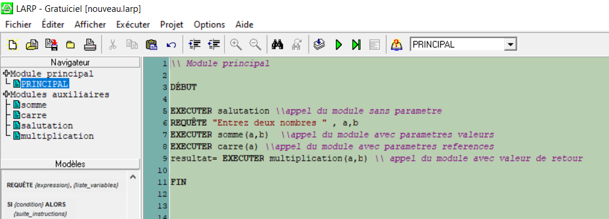
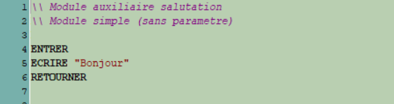
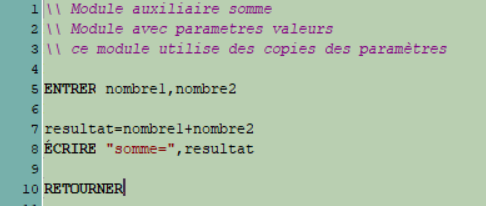
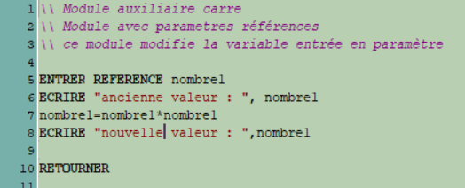
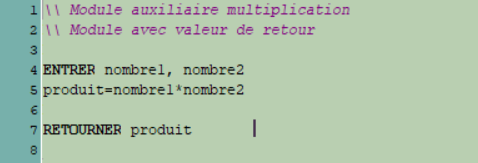

## But de ce TD

Se familiariser avec les **modules auxiliaires**, répondre à des problèmes en structurant les algorithmes.

## Pour ce TD

Savoir écrire un pseudo-code sur LARP, connaître les différents type de modules et savoir les utiliser.

Documentation complète sur les modules : _https://larp.marcolavoie.ca/fr/DocHTM/index.htm_, **section 1**

## Les modules

Pour simplifier la structure d’un algorithme, on peut le diviser en plusieurs sections. Ces sections sont appelées **modules**. Ils servent à exécuter des tâches simples. Par exemple : réaliser un calcul, afficher un menu ou des résultats.
Les modules sont similaires aux fonctions.

Chaque algorithme sur LARP possède un **module principal** où se trouvent les instructions principales. C’est là qu’on appelle les **modules auxiliaires**. L’instruction "EXECUTER" est omissible.

Le module principal est structuré de la façon suivante :

    DÉBUT
    \\instructions
    FIN

Tandis que les modules auxiliaires se présentent comme ceci :

    ENTRER
    \\instructions
    RETOURNER

Exemple de module principal :

Il existe plusieurs types de modules auxiliaires :

- _Module sans paramètre_. Ici, le module affiche simplement un message.

- _Module avec paramètres valeurs_. Ce module prend deux paramètres, exécute un calcule et affiche le résultat. Les variables dans le module principal ne sont pas affectées.

- _Module avec paramètres références_. Le paramètre n’est pas une copie mais une référence, c’est-à-dire un autre nom pour la même variable. C’est pour cela que sa valeur est modifiée en dehors du module auxiliaire.

- _Module avec valeur de retour_. La valeur de la variable "produit" est envoyée vers le module principal.

