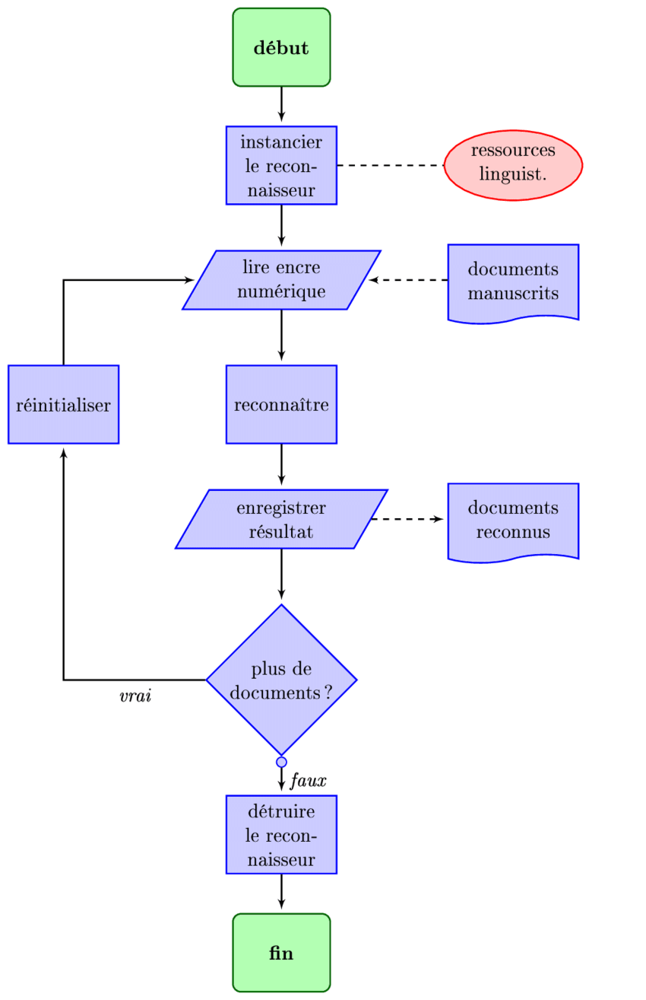

## Organigramme

C'est quoi ?

### Définition classique

_Un organigramme de programmation (parfois appelé algorigramme, logigramme ou plus rarement ordinogramme) est une représentation graphique normalisée de l'enchaînement des opérations et des décisions effectuées par un algorithme._

Voici une vidéo que nous avons réalisé afin que vous compreniez mieux le sujet:

A quoi ça sert ?

Un **organigramme** n'est autre qu'une forme de représentation d'un algorithme, il permet grace à son aspect très **visuel**, de décrire le déroulement **d'algorithmes** qui peuvent parfois apparaître complexes, à l'aide de **règles simples**.

Voici une fiche _issue du cours_ qui résume les éléments de base qui le compose:

**En clair**, n'importe quel algorithme que vous réalisez peut (et doit 😄) s'écrire sous forme d'organigramme.

Pour que vous puissiez visualiser facilement comment il se présente pour un algorithme que vous connaissez déjà, nous allons reprendre notre exemple sur le [château de sable](./algo.md):

Pour finir, il y a certaines règles qu'il ne faut pas oublier sur les Organigrammes:

- **Les flèches**: il faut toujours tracer ses flèches de manière horizontale ou verticale et selon des angles droits. De plus, **le sens des flèches est capital**, c'est lui qui dirige l'algorithme, et sans ça, impossible de savoir où on va !
- **Les conditions**: il s'agit des termes "Oui" et "Non" placés sur les flèches sur les blocs de type question, il ne faut pas que vous oubliez **toutes les possibilités** que peuvent engendrer ces blocs!
- **La vérif'**: il faut impérativement que l'algorithme possède une fin, ou alors qu'il revienne sur une boucle. Souvenez-vous, **impossible de ne pas finir!**

C'est l'essentiel de ce qu'il faut retenir pour la partie sur les Organigrammes! 💻

Si vous vous sentez toujours perdu ou voulez approfondir votre connaissance, allez [ici.](./orga_ressources.md)

Si vous voulez passer directement au exercices, c'est par [ici.](./orga_exercices.md)
